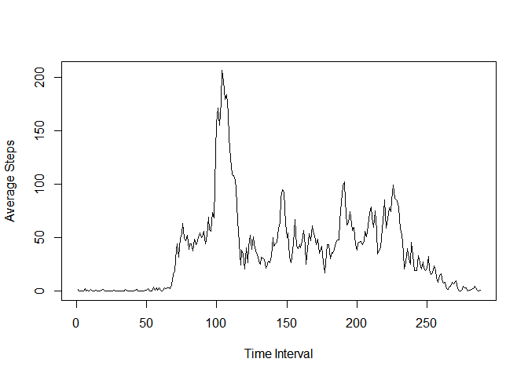
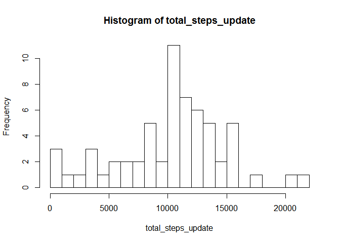
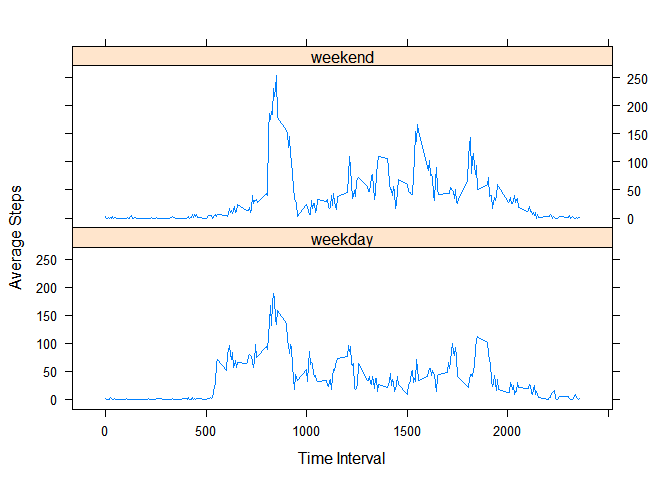

# Reproducible Research: Peer Assessment 1

```r
library(plyr)
library(lattice)
library(reshape2)
library(lubridate)
```

## Loading and preprocessing the data

```r
# Load data from zip file
activity_data_raw <- read.csv(unz("activity.zip","activity.csv"))

# Convert the dates to date objects
activity_data_raw$date<- as.Date(activity_data_raw$date, format='%Y-%m-%d')

# It does not make sense to average over the missing valuse, but 
# It appears to be part of the exercise, to show that the valuse 
# change after dealing with the missing data. So I will use the raw data
# and deal with missing values when taking the mean.
```


## What is mean total number of steps taken per day?

```r
total_steps <- by(activity_data_raw$steps, activity_data_raw$date, sum, na.rm=TRUE )
hist(total_steps, breaks=20)
```

 

```r
mean_steps <- mean(total_steps)
median_steps <- median(total_steps)
```
The mean total number of steps is 9354.2295082.    
The median total number of steps is 10395.  

## What is the average daily activity pattern?

```r
avg_step_pattern <- with(activity_data_raw, tapply(steps, interval, mean, na.rm=TRUE))
xIntervals <- unique(activity_data_raw$interval)
with(activity_data_raw, plot(xIntervals, avg_step_pattern, type="l", 
                             xlab = "Time Interval", ylab = "Average Steps"))
```

 

```r
max_interval=as.numeric(which(avg_step_pattern==max(avg_step_pattern), arr.ind=TRUE))
```

The interval with the maximun number of steps on average across all days is 835.    

## Imputing missing values

```r
num_missing_vals = length(activity_data_raw[is.na(activity_data_raw$steps),1])
missing_vals<-activity_data_raw[is.na(activity_data_raw),]
# missing vals are complete days
foo <- by(missing_vals$steps, missing_vals$date, count)
# The missing values are completed days with no data.
# All of the missing values for the day will be filled with an interpolated mean value for the day.
# The filter function will be used to average the 
# daily mean value to the left and the right of missing daily mean.
# This is a quick and dirty interpolation between available data points
#  xdailymean[missing] = 0.5*xdailymean[missing-1]+0.5*xdailymean[missing+1]
dailyAve <- by(activity_data_raw$steps, activity_data_raw$date, mean)
dailyAvePad = as.numeric(c(0,0,0,dailyAve,0,0,0))
dailyAvePad[is.na(dailyAvePad)] <- 0
dailyAvePadFiltered<-filter (dailyAvePad, filter = c(1/2, 0, 1/2), sides=2)
dailyAveVec<-as.numeric(dailyAve)
dailyAveFill=dailyAvePadFiltered[4:64]
na_fill_vals <- dailyAveFill[is.na(dailyAve)]
dailyAveVec[is.na(dailyAveVec)] <- dailyAveFill[is.na(dailyAve)]
#generate list of dates to update
na_dates <- unique(activity_data_raw[is.na(activity_data_raw$steps),2])
activity_data_raw_update <- activity_data_raw;
activity_data_raw_update[activity_data_raw$date==na_dates[1],1]<-na_fill_vals[1]
activity_data_raw_update[activity_data_raw$date==na_dates[2],1]<-na_fill_vals[2]
activity_data_raw_update[activity_data_raw$date==na_dates[3],1]<-na_fill_vals[3]
activity_data_raw_update[activity_data_raw$date==na_dates[4],1]<-na_fill_vals[4]
activity_data_raw_update[activity_data_raw$date==na_dates[5],1]<-na_fill_vals[5]
activity_data_raw_update[activity_data_raw$date==na_dates[6],1]<-na_fill_vals[6]
activity_data_raw_update[activity_data_raw$date==na_dates[7],1]<-na_fill_vals[7]
activity_data_raw_update[activity_data_raw$date==na_dates[8],1]<-na_fill_vals[8]

total_steps <- by(activity_data_raw$steps, activity_data_raw$date, sum, na.rm=TRUE )
hist(total_steps, breaks=20)
```

 

```r
total_steps_update <- by(activity_data_raw_update$steps, activity_data_raw_update$date, sum, na.rm=TRUE )
hist(total_steps_update, breaks=20)
```

 

```r
mean_steps <- mean(total_steps)
median_steps <- median(total_steps)

mean_steps_update <- mean(total_steps_update)
median_steps_update <- median(total_steps_update)
```

The number of missing values in the inital data set is 2304.    
The previous mean total number of steps is 9354.2295082.  
The updated mean total number of steps is 1.0183959\times 10^{4}.  
The previous median total number of steps is 10395.    
The updated median total number of steps is 1.0571\times 10^{4}.  


## Are there differences in activity patterns between weekdays and weekends?

```r
tday <- function(x) {
  if (x<5) {
    return("weekday")
  } else {
    return("weekend")
  }
}

activity_data_raw$typeDay<-lapply(wday(activity_data_raw$date), tday)
activity_data_raw$typeDay<-factor(as.character(activity_data_raw$typeDay))
mdata <- melt(activity_data_raw, id=c("typeDay","date", "interval"), measure.vars = c("steps"))
goo <-dcast(mdata, typeDay+interval ~ variable, fun.aggregate=mean, na.rm=TRUE)
xyplot(goo$steps ~ goo$interval | goo$typeDay, type='l', layout=c(1,2), xlab = "Time Interval", ylab = "Average Steps")
```

 
