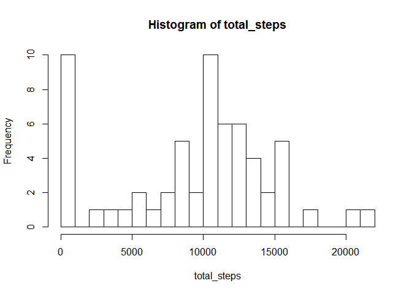

# Reproducible Research: Peer Assessment 1


## Loading and preprocessing the data

```r
activity_data_raw <- read.csv(unz("activity.zip","activity.csv"))
activity_data_raw$date<- as.Date(activity_data_raw$date, format='%Y-%m-%d')
activity_data <- activity_data_raw[!is.na(activity_data_raw$steps),]
# remove extra levels associated with missing data
activity_data$date <- factor(activity_data$date)
```


## What is mean total number of steps taken per day?

```r
total_steps <- by(activity_data$steps, activity_data$date, sum )
hist(total_steps, breaks=20)
```

 

```r
mean_steps <- mean(total_steps)
median_steps <- median(total_steps)
```
The mean total number of steps is 1.0766189\times 10^{4}.    
The median total number of steps is 10765.  

## What is the average daily activity pattern?

```r
avg_step_pattern <- with(activity_data, tapply(steps, interval, mean))
with(activity_data, plot(1:288, avg_step_pattern, type="l", xlab = "Time Interval", ylab = "Average Steps"))
```

 

```r
max_interval=as.numeric(which(avg_step_pattern==max(avg_step_pattern), arr.ind=TRUE))
```

The interval with the maximun number of steps on average across all days is 104  

## Imputing missing values

```r
library(plyr) 
```

```
## Warning: package 'plyr' was built under R version 3.2.2
```

```r
num_missing_vals = length(activity_data_raw[is.na(activity_data_raw$steps),1])
missing_vals<-activity_data_raw[is.na(activity_data_raw),]
foo <- by(missing_vals$steps, missing_vals$date, count)
# missing vals are complete days
# average day on each side to replace missing vals
dailyAve <- by(activity_data_raw$steps, activity_data_raw$date, mean)
dailyAvePad = as.numeric(c(0,0,0,dailyAve,0,0,0))
dailyAvePad[is.na(dailyAvePad)] <- 0
dailyAvePadFiltered<-filter (dailyAvePad, filter = c(1/2, 0, 1/2), sides=2)
dailyAveVec<-as.numeric(dailyAve)
dailyAveFill=dailyAvePadFiltered[4:62]
na_fill_vals <- dailyAveFill[is.na(dailyAve)]
dailyAveVec[is.na(dailyAveVec)] <- dailyAveFill[is.na(dailyAve)]
#generate list of dates to update
na_dates <- unique(activity_data_raw[is.na(activity_data_raw$steps),2])
filler_key <- data.frame(na_dates, na_fill_vals)
```

The number of missing values in the inital data set is 2304.    

## Are there differences in activity patterns between weekdays and weekends?

```r
library(lattice)
library(reshape2)
```

```
## Warning: package 'reshape2' was built under R version 3.2.2
```

```r
library(lubridate)
```

```
## Warning: package 'lubridate' was built under R version 3.2.2
```

```
## 
## Attaching package: 'lubridate'
## 
## The following object is masked from 'package:plyr':
## 
##     here
```

```r
tday <- function(x) {
  if (x<5) {
    return("weekday")
  } else {
    return("weekend")
  }
}

activity_data_raw$typeDay<-lapply(wday(activity_data_raw$date), tday)
activity_data_raw$typeDay<-factor(as.character(activity_data_raw$typeDay))
mdata <- melt(activity_data_raw, id=c("typeDay","date", "interval"), measure.vars = c("steps"))
goo <-dcast(mdata, typeDay+interval ~ variable, fun.aggregate=mean, na.rm=TRUE)
xyplot(goo$steps ~ goo$interval | goo$typeDay, type='l', layout=c(1,2), xlab = "Time Interval", ylab = "Average Steps")
```

 
